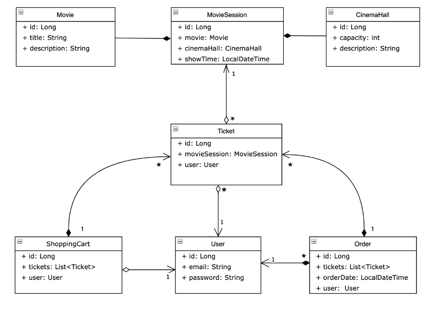

# :video_camera: Cinema-app 
### DESCRIPTION
>A web application that supports authentication, registration, and logic of ordering tickets.
booking service based on Hibernate and Spring frameworks using general REST principles.

### :mag: FEATURES
- register and log in as a user/administrator;
#### Registered as USER role:
- find movies and cinema halls
- find available movie sessions
- create shopping cart
- add tickets to shopping cart
- view shopping cart
- make an order
- view order history
#### Registered as ADMIN role:
- create and find movies and cinema halls
- create and find available movie sessions
- find user by email

### :green_book: Project structure
> The project has a Three-Tier Architecture:

| Layer                                 | Responsibilities                                                              | 
|---------------------------------------|-------------------------------------------------------------------------------|
| **Presentation layer (Controllers)**  | Accepts requests from clients and sends results back to them.                 |
| **Application logic layer (Service)** | Provide logic to operate on the data sent to and from the DAO and the client. |
| **Data access layer (DAO)**           | Represents a bridge between the database and the application.                 |

### :hammer: Technologies
* Hibernate Core
* Hibernate Validator
* Spring WebMvc
* Spring Context
* Spring Security
* Apache Maven
* MySQL Connector Java
* JWT

### DB Diagram

### :memo: Technical details
* Entities represent columns in the database;
* DTOs represent communication between Presentation and Service layers;
* DTO mappers convert DTOs to entities and vice versa
* BCryptPasswordEncoder is used for password encryption
* Hibernate annotations are used for field validation
* Custom annotations are used for email and password validation
* Jackson API is responsible for converting objects to JSON
* Config package contains classes allow to configure Spring and Hibernate
* Security package contains class, allows to create UserDetails which store user information;
* JWT make this application stateless
### :door: Steps to run the program on your computer:
* Clone the repo [here](https://github.com/Nikitos787/cinema-app.git);
* Install MySQL;
* Use [init_db.sql](src/main/resources/init_db.sql) file for creating your local database.
* Open [db.properties](src/main/resources/db.properties) file and write information about your database.
* db.driver= "YOUR_DRIVER"
* db.url= jdbc:mysql://YOUR_DATABASE_URL/cinema_app
* db.user= "YOUR_USERNAME"
* db.password= "YOUR_PASSWORD"
* Configure Apache Tomcat version 9.0.50 Artifact: war-exploded artifact, Application context: "/";
* Create connection to DB using Database option (Intellij Idea Ultimate).

#### You can log in both as USER or ADMIN:
* **ADMIN**: username: *admin@i.ua*, password: *admin123*
* **USER**: username: *user@i.ua*, password: *user1234*
* Use **Postman** to send some http requests;
* Press debug button.

### :open_file_folder: Recommendations 
> The application does not have JSP pages, so use Postman to access it. When you start the application, there will already be two users in the database: one with the role of admin and the other with the role of user. You can view their data in the DataInitializer class. When using the program, you can log in using their credentials or register yourself. However, please ensure that your data is valid during the registration process.
> 
>Yes, this application follows the REST architectural style, making it stateless. A token will be sent to you upon logging in. Therefore, in the future, you will need to add the token to the 'Authorization-Bearer Token' section in Postman. This token will be included in the header. After that, you can visit and perform actions according to the granted rights (admin or user).
>
> All permissions can be found inside the SecurityConfig class, specifically in the configure method. Additionally, you can find information about the methods (GET, POST, UPDATE, or DELETE) that should be used for each page.

